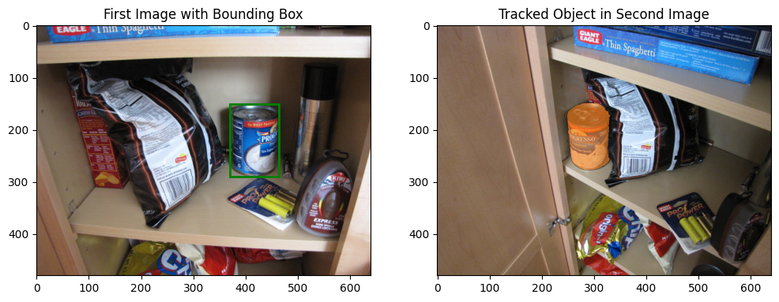

# Object Detection and Tracking with SAM2 Model

This project demonstrates object detection in an image and tracking the same object across frames using the SAM2 model. SAM2 is designed for automatic mask generation and object tracking in videos.





## Libraries Used

The following libraries are crucial for the functioning of the code:

- `torch`: For loading and running the SAM2 model on a CUDA device.
- `PIL` and `matplotlib`: For image handling and visualization.
- `os`, `glob`, and `shutil`: For file and directory management.

Ensure that all dependencies are correctly installed and compatible with each other. Configuring `torch` to work on a CUDA-enabled device can sometimes cause issues, especially if the correct CUDA version is not installed.

## Code Overview

### Importing Required Libraries

```python
import torch
from sam2.build_sam import build_sam2, build_sam2_video_predictor
from sam2.automatic_mask_generator import SAM2AutomaticMaskGenerator
from sam2.sam2_image_predictor import SAM2ImagePredictor
from PIL import Image
import numpy as np
import matplotlib.pyplot as plt
import os, glob, shutil
import matplotlib.patches as patches

#These libraries are crucial for the functioning of the code ,torch is used for loading and running the SAM2 model on a CUDA device.
#PIL and matplotlib are for image handling and visualization,os, glob, and shutil handle file and directory management.

#Ensuring all dependencies were correctly installed and compatible with each other. For instance, configuring torch to work on a CUDA-enabled device can sometimes cause #issues, especially if the correct CUDA version is not installed.

#Improved Image Processing Function


  def process_img_png_mask(imgpath, maskpath, visualize=False):
    try:
        # Load the image and mask
        img = Image.open(imgpath)
        mask = Image.open(maskpath)
        
        # Convert the mask to a binary format (0 and 1)
        mask = mask.convert("L")  # Convert to grayscale
        mask_np = np.array(mask) / 255  # Normalize to binary
        
        # Ensure mask is binary (0s and 1s)
        mask_np[mask_np > 0] = 1
        
        # Find bounding box coordinates based on the binary mask
        rows = np.any(mask_np, axis=1)
        cols = np.any(mask_np, axis=0)
        ymin, ymax = np.where(rows)[0][[0, -1]]
        xmin, xmax = np.where(cols)[0][[0, -1]]
        
        # If visualization is enabled, show the bounding box on the image
        if visualize:
            plt.figure()
            plt.imshow(img)
            plt.gca().add_patch(plt.Rectangle((xmin, ymin), xmax - xmin, ymax - ymin, edgecolor='red', facecolor='none', lw=2))
            plt.title('Bounding Box on First Image')
            plt.show()
        
        return xmin, xmax, ymin, ymax
    except Exception as e:
        print(f"Error in process_img_png_mask: {e}")
        raise

#This function processes an image and its corresponding mask to identify the bounding box of the object of interest. The mask is converted to a binary format, and the #bounding box coordinates are extracted based on the areas where the mask is active (i.e., where the object is present).
#The function also includes an option to visualize the bounding box.

#Handling different image formats and ensuring that the mask accurately represents the object.
#Debugging issues related to bounding box extraction, especially when the mask did not align perfectly with the object in the image.


#Object Tracking Across Frames

def track_item_boxes(first_img_path, second_img_path, boxes, predictor_vid, visualize=False):
    try:
        # Load images
        first_img = Image.open(first_img_path)
        second_img = Image.open(second_img_path)

        # Initialize tracking using SAM2's video predictor
        tempfolder = "./tempdir"
        create_if_not_exists(tempfolder)
        cleardir(tempfolder)

        shutil.copy(first_img_path, tempfolder + "/00000.jpg")
        shutil.copy(second_img_path, tempfolder + "/00001.jpg")

        # Initialize inference state for video tracking
        inference_state = predictor_vid.init_state(video_path=tempfolder)
        predictor_vid.reset_state(inference_state)

        ann_frame_idx = 0  # Annotated frame is the first image
        video_segments = {}

        # Track the object across images
        for box, object_id in boxes:
            xmin, xmax, ymin, ymax = map(int, box)
            sam_box = np.array([xmin, ymin, xmax, ymax], dtype=np.float32)
            
            # Add new points or boxes for tracking
            _, out_obj_ids, out_mask_logits = predictor_vid.add_new_points_or_box(
                inference_state=inference_state,
                frame_idx=ann_frame_idx,
                obj_id=object_id,
                box=sam_box,
            )
            
            # Propagate tracking across frames
            for out_frame_idx, out_obj_ids, out_mask_logits in predictor_vid.propagate_in_video(inference_state):
                video_segments[out_frame_idx] = {
                    out_obj_id: (out_mask_logits[i] > 0.0).cpu().numpy()
                    for i, out_obj_id in enumerate(out_obj_ids)
                }

        # Visualization of tracked objects
        if visualize:
            # Show the first image with bounding box
            fig, ax = plt.subplots(1, 2, figsize=(12, 6))
            ax[0].imshow(first_img)
            rect = patches.Rectangle((xmin, ymin), xmax-xmin, ymax-ymin, edgecolor='green', facecolor='none', lw=2)
            ax[0].add_patch(rect)
            ax[0].set_title("First Image with Bounding Box")

            # Show the second image with the mask overlaid
            ax[1].imshow(second_img)
            ax[1].setTitle("Tracked Object in Second Image")
            for out_obj_id, out_mask in video_segments[1].items():  # Second frame index = 1
                show_mask(out_mask, ax[1], obj_id=out_obj_id)
            plt.show()

        return video_segments
    except Exception as e:
        print(f"Error in track_item_boxes: {e}")
        raise

#This function tracks the object identified in the first image (using its bounding box) across frames using the SAM2 video predictor.
#It initializes the tracking environment, loads the images, and propagates the tracking information across frames.
#If visualization is enabled, it displays the object in the first image with a bounding box and the tracked object in the second image.

#Managing the initialization of the video tracking state and ensuring that the propagation of the tracking information works correctly.
#Debugging issues related to incorrect object tracking, such as when the object’s mask was not correctly applied in subsequent frames.


#Helper Functions for Visualization

def show_mask(mask, ax, obj_id=None, random_color=False):
    if random_color:
        color = np.concatenate([np.random.random(3), np.array([0.6])], axis=0)
    else:
        cmap = plt.get_cmap("tab10")
        color = np.array([*cmap(obj_id)[:3], 0.6])
    h, w = mask.shape[-2:]
    mask_image = mask.reshape(h, w, 1) * color.reshape(1, 1, -1)
    ax.imshow(mask_image)

#This function displays the mask of the tracked object on the image. The mask is color-coded based on the object ID.
#The function can either use a random color or a predefined color scheme.

#Ensuring that the mask is correctly aligned with the image and that the color coding is consistent across frames.
##Directory Management Functions

def create_if_not_exists(dirname):
    if not os.path.exists(dirname):
        os.mkdir(dirname)

def cleardir(tempfolder):
    filepaths = glob.glob(tempfolder + "/*")
    for filepath in filepaths:
        os.unlink(filepath)

#These helper functions manage the directories used in the code. create_if_not_exists creates a directory if it doesn’t already exist, and cleardir clears all files from a #given directory.

#Ensuring that the directory management is handled correctly, particularly when dealing with temporary files that need to be cleaned up after processing.


#Initialize the SAM2 Model

checkpoint = "C:/Users/victus/Documents/segment-anything-2/sam2_hiera_tiny.pt"
model_cfg = "C:/Users/victus/Documents/segment-anything-2/sam2_hiera_t.yaml"
sam2 = build_sam2(model_cfg, checkpoint, device='cuda', apply_postprocessing=False)
mask_generator = SAM2AutomaticMaskGenerator(sam2)
predictor_vid = build_sam2_video_predictor(model_cfg, checkpoint, device='cuda')

#This step initializes the SAM2 model using the provided checkpoint and configuration files. The model is loaded onto a CUDA device for faster processing.

#Ensuring that the correct paths are provided for the checkpoint and configuration files.
#Handling issues related to CUDA, such as compatibility and device memory constraints.


#Process the First Image to Get Bounding Box Coordinates

firstimgpath = './CMU10_3D/data_2D/can_chowder_000001.jpg'
firstimgmaskpath = './CMU10_3D/data_2D/can_chowder_000001_1_gt.png'
secondimgpath = './CMU10_3D/data_2D/can_chowder_000002.jpg'

[xmin, xmax, ymin, ymax] = process_img_png_mask(firstimgpath, firstimgmaskpath, visualize=True)

#The first image and its mask are processed to extract the bounding box coordinates, which will be used for object tracking.

#Ensuring that the mask correctly represents the object in the image and that the bounding box accurately captures the object’s position.


#Track the Object Between the First and Second Images

boxes = [([xmin, xmax, ymin, ymax], 1)]
tracked_segments = track_item_boxes(firstimgpath, secondimgpath, boxes, predictor_vid, visualize=True)

print("Tracked Masks for Each Frame:")
for frame_idx, masks in tracked_segments.items():
    print(f"Frame {frame_idx}:")
    for obj_id, mask in masks.items():
        print(f"  ObjectA {obj_id} Mask:")
        print(mask)

#The object identified in the first image is tracked in the second image, and the results are printed for each frame.
#Ensuring that the object tracking is consistent and that the results are accurate. Debugging tracking issues when the mask did not align with the object was particularly #challenging.


Working on this project has been an incredibly rewarding experience. It allowed me to dive deep into the intricacies of object detection and tracking, leveraging advanced tools like the SAM2 model. I faced several challenges along the way, from managing dependencies to fine-tuning the tracking algorithm, but each hurdle provided an opportunity to learn and grow.*

What I found most exciting was the ability to see tangible results—watching an object seamlessly tracked across frames was a gratifying moment. It reinforced my passion for data science and the potential it has to solve real-world problems.
I am genuinely happy to have had the opportunity to work on this project, and I look forward to applying these learnings to future challenges. Thank you for the chance to contribute and for pushing me to refine my skills.

Best regards,
Kushal Kumar D
Kushalkumard001@gmail.com


